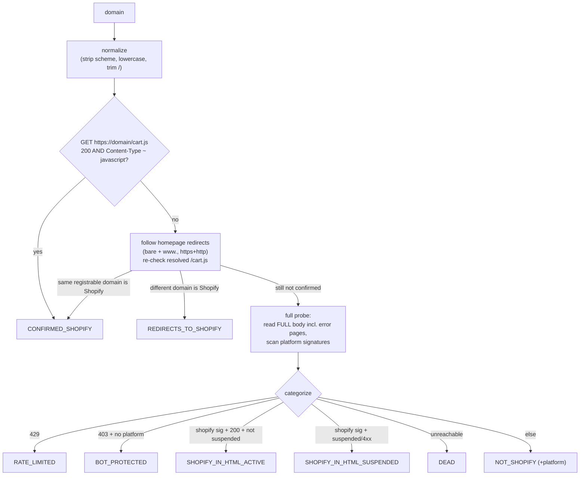

# shopify-domain-detector

**Detect whether any web domain is a live Shopify store — dependency-free, fast, redirect- and WAF-aware.**

[](https://github.com/ahmedxomar101/shopify-domain-detector/actions/workflows/ci.yml)
[](LICENSE)
[](https://www.python.org/)
[](pyproject.toml)

`shopify-domain-detector` answers one question accurately and at scale: **is this domain a real, live Shopify store?** It's built for lead-list enrichment, ecommerce market research, and competitive analysis — anywhere you need to bulk-check whether websites run on Shopify.

It uses an authoritative `/cart.js` probe, follows redirects, reads full HTML bodies (including error pages behind bot-protection), and distinguishes *live* stores from *suspended*, *dead*, and *bot-protected* ones — not just a naive yes/no. Pure Python standard library: **no dependencies, no API keys, no browser.**

## Why

Checking "is this website on Shopify?" naively (grep the homepage for "shopify") is wrong a lot: it misses stores behind Cloudflare/WAFs, counts dead/suspended stores as live, and is fooled by redirects and vanity domains. This library encodes the techniques that make detection reliable in bulk:

- **Authoritative first signal** — Shopify's `/cart.js` returns JavaScript with a 200 only on real storefronts.
- **Reads error-page bodies** — many live Shopify stores behind a WAF return 403/404 whose HTML still leaks Shopify signatures.
- **Redirect- and subdomain-aware** — `www`, `shop.`, vanity domains, and country-code TLDs (`.co.uk`, `.com.au`) are handled via registrable-domain comparison.
- **Honest categories** — live vs suspended vs dead vs bot-protected vs other-platform, so you can decide what counts as a usable lead.

## Install

```bash
pip install git+https://github.com/ahmedxomar101/shopify-domain-detector@v0.1.0
```

## Quickstart

```python
from shopify_domain_detector import classify_domain, classify_domains

r = classify_domain("gymshark.com")
print(r.category.value, r.is_shopify)   # confirmed-shopify True

results = classify_domains(["gymshark.com", "apple.com", "example.com"], workers=15)
for domain, res in results.items():
    print(domain, res.category.value, res.is_shopify)
```

CLI:

```bash
# one domain per line in domains.txt
shopify-detect --from-file domains.txt --format summary
shopify-detect --from-file domains.txt --format jsonl > results.jsonl
```

## How detection works



**Stage 1 — authoritative.** `GET /cart.js`: a 200 with a JavaScript content-type is a strong positive (real Shopify storefronts serve a JSON/JS cart). If the lead's domain redirects to a *different* domain that is Shopify, it's flagged `REDIRECTS_TO_SHOPIFY` (a vanity/parked domain), not a false positive on the lead.

**Stage 2 — HTML signature fallback.** For everything else, fetch the homepage across `https`/`http` and the bare + `www.` hosts, reading the **full body even on 4xx/5xx error pages**, and scan for platform signatures (`cdn.shopify.com`, `myshopify.com`, plus 14 other platforms for negative classification).

**Categorize.** Rate-limit (429) and bot-protection (403 with no recognizable platform) are separated from content so they don't masquerade as "not Shopify." Shopify pages that show "this store is unavailable" or return 4xx are marked *suspended* (a closed store — not a usable lead).

## Categories

| Category | Healthy? | Meaning |
|----------|:--------:|---------|
| `confirmed-shopify` | ✅ | `/cart.js` confirmed a live Shopify storefront |
| `shopify-in-html-active` | ✅ | Shopify signature in a live (200) homepage |
| `redirects-to-shopify` | — | Resolves to a *different* Shopify domain (vanity/parked) |
| `shopify-in-html-suspended` | — | Shopify store, but closed/unavailable/4xx |
| `not-shopify` | — | A different platform (or none) was detected |
| `dead` | — | DNS/SSL/connection failure — unreachable |
| `rate-limited` | — | 429 — retry later |
| `bot-protected` | — | 403 with an empty/unknown body — platform indeterminate |

"Healthy" (`result.is_shopify`) = `confirmed-shopify` + `shopify-in-html-active`.

## Accuracy & methodology

Detection is **signature-based**, not a guarantee. In a controlled run, results were **99% consistent between a residential IP and datacenter IPs (GitHub Actions)** across 1,056 of the hardest-to-classify domains — confirming the classification is stable across environments and that `not-shopify` verdicts reflect real platform signals rather than IP-based blocking. `bot-protected` and `rate-limited` are deliberately separate categories so indeterminate fetches never silently become false negatives.

## Performance

- Pure standard library, thread-pooled (`classify_domains(..., workers=N)`).
- I/O-bound: throughput scales with concurrency and network; tune `workers` and batch politely against the same host range to avoid rate-limiting.
- No browser, no headless Chrome — just HTTP.

## API

```python
classify_domain(domain: str) -> DomainResult
classify_domains(domains: list[str], workers: int = 15) -> dict[str, DomainResult]
categorize(probe: ProbeResult) -> tuple[Category, str | None]   # pure, testable
probe_domain(domain: str) -> ProbeResult
```

`DomainResult` fields: `domain`, `category` (`Category`), `platform` (for `not-shopify`), `redirects_to` (for `redirects-to-shopify`), `status`, and the `is_shopify` convenience property.

## Security & ethics

- **TLS is verified by default.** It falls back to an unverified read **only** when a certificate genuinely fails to validate, so misconfigured stores can still be classified. No data is sent; only public HTML is read for classification.
- Fetches only public homepages and `/cart.js`. Rate-limit your runs; respect target sites.
- Not affiliated with or endorsed by Shopify. "Shopify" is a trademark of its owner.

## License

MIT — see [LICENSE](LICENSE).
