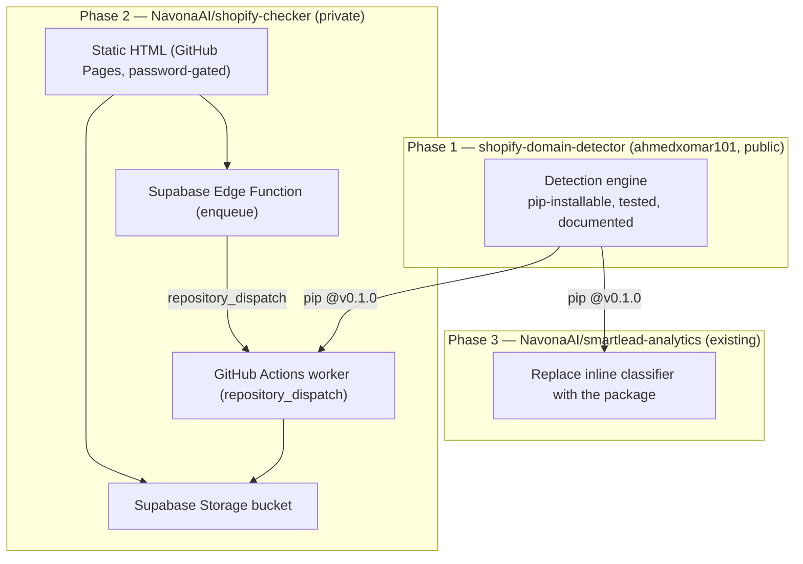

# Epic: Self-Serve Shopify Lead Checker — Program Overview

**Goal:** Give the marketing team a zero-friction way to run lead lists through
Shopify detection before use, built on a reusable open-source detection engine —
with no Vercel, no backend server, and no risk to the existing analytics pipeline.

**Why now:** Verified (2026-06-07) that Shopify detection is IP-independent — 99%
agreement between GitHub datacenter runners and a local residential Mac across
1,056 hard domains. That unlocks running the scrape on free GitHub Actions and
proves the existing high "not-shopify" rates are real lead-quality signal, not a
scraping artifact. The checker turns that one-off verification into a standing
self-serve tool.

## The three subsystems

## Build sequence (strict dependency order)

| Phase | Subsystem | Ships | Depends on |
|-------|-----------|-------|------------|
| 1 | `shopify-domain-detector` | Tested, tagged `v0.1.0` package + brand docs | — |
| 2 | `shopify-checker` | Colleague-facing tool (link + password) | Phase 1 `@v0.1.0` |
| 3 | `smartlead-analytics` migration | Same Sheet output, one fewer copy of logic | Phase 1 `@v0.1.0` |

Phase 1 is the dependency root — build and tag it first. Phases 2 and 3 are
independent of each other and can run in parallel once Phase 1 is tagged.

## Locked decisions (shared across phases)

- **Detector home:** `ahmedxomar101/shopify-domain-detector`, public, MIT.
  Consumed via `pip install git+...@<tag>`. Owned personally; Navona apps pin tags.
- **Single source of truth:** both Navona apps depend on the package; no copies.
- **Storage-only, no SQL table.** Per-job folder `shopify-checks/<jobId>/` in a
  Supabase Storage bucket holds `input.csv`, `meta.json`, `status.json`, outputs.
- **Push trigger, not cron-poll.** A Supabase Edge Function holds the GitHub
  token and fires `repository_dispatch` on enqueue (cron-poll at `*/5` would burn
  ~8,600 billed min/month — GitHub rounds each run up to 1 min).
- **Worker runs under NavonaAI** so compute bills to Navona. Detector CI runs
  under the personal public repo (free/unlimited).
- **Output buckets:**
  - `shopify` = `confirmed-shopify` + `shopify-in-html-active` + `redirects-to-shopify`
  - `uncertain` = `bot-protected` + `dead` + `rate-limited` + `shopify-in-html-suspended`
  - `not-shopify` = everything else
  Plus the legacy artifacts (`report.json`, `report.md`, category `.txt`) and the
  three row-level CSVs, dropped individually under the job folder **and** zipped.
- **Volume:** ≤ 100k domains/month → within GitHub Actions free tier; no caching.
- **Security posture:** TLS verified by default with a documented unverified read
  fallback for broken-cert stores (Phase 1); SRI on all CDN scripts in the static
  HTML (Phase 2); bucket RLS + shared-password gate; no secrets in the browser.

## Process compliance (DEVELOPMENT_PROCESS.md)

Applies to all three plans:

- **Feature branches off `master`/`main`** with `feat/` / `refactor/` / `chore/`
  prefixes. New repos: initial scaffold commit establishes `main`, then task work
  proceeds on a `feat/initial-implementation` branch merged via a reviewed PR.
- **TDD iron law:** failing test first, then minimal code, then refactor. No
  production code without a failing test (infra/static-asset tasks use the stated
  verification command as their gate).
- **Commit after every task/sub-step** (scaffold, red test, green impl, lint) —
  history tells a story; never one giant commit.
- **Never merge without a code review.** Per PR: `code-review:code-review`,
  two-stage (spec compliance → quality). Squash-merge + delete branch.
- **Verification before completion:** run the gate command fresh, read the full
  output, cite evidence — no "should work".
- **Safety:** the deployed KPI Sheet pipeline (`smartlead-analytics` `master`)
  must keep working throughout. Phase 3 stays on a branch and merges only on
  green parity + review; Phases 1–2 are separate repos and cannot affect it.
- **Security/SEO audits:** Phase 1 is a public web-facing brand repo → run
  `seo-audit` on the README and `security-review` before tagging `v0.1.0`. Phase 2
  exposes a public page + new transport (Edge Function, anon-key uploads) → run
  `security-review` before sharing the link with colleagues.

## Definition of done (per phase)

- **Phase 1:** `pytest` + `ruff` green in CI on 3.10–3.12; README with mermaid +
  SEO; `AGENTS.md`; tagged `v0.1.0`; `pip install git+...@v0.1.0` works from a
  clean env.
- **Phase 2:** a colleague opens the Pages link, enters the password, uploads a
  CSV, picks the column, and downloads correct `shopify.csv` / `not-shopify.csv`
  / `uncertain.csv` + `report.json`; worker triggered by `repository_dispatch`;
  no secret in the client; idle GitHub minutes ≈ 0.
- **Phase 3:** `smartlead-analytics` imports the package; a real campaign produces
  a byte-identical `report.json` vs the pre-migration baseline; the daily Sheet
  pipeline behaves identically.

## Plans
- Phase 1 — `2026-06-07-shopify-domain-detector.md`
- Phase 2 — `2026-06-07-shopify-checker.md`
- Phase 3 — `2026-06-07-analytics-detector-migration.md`

## Top risks & mitigations
- **Datacenter rate-limiting at 100k:** shard the worker (matrix) so each shard
  is a separate runner/IP; self-throttle batches. (Phase 2, optional v2.)
- **Personal-repo dependency for Navona prod:** pin tags; the package is public
  so installs need no auth and a deletion can't silently change a pinned build
  mid-run (re-install would fail loudly, not corrupt output).
- **Behavior drift from the refactor:** Phase 3 gates merge on byte-identical
  `report.json` parity against a committed baseline.
