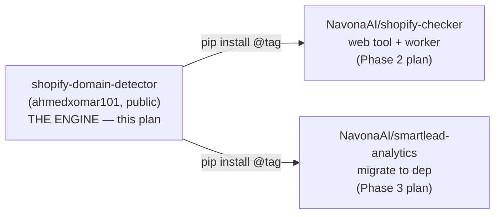
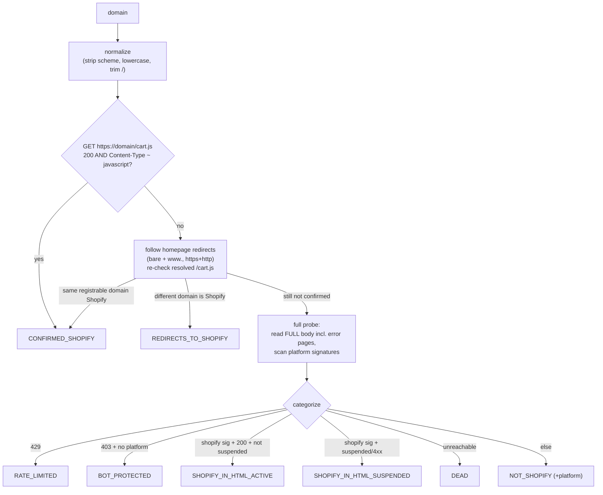

# shopify-domain-detector Implementation Plan

> **For agentic workers:** REQUIRED SUB-SKILL: Use superpowers:subagent-driven-development (recommended) or superpowers:executing-plans to implement this plan task-by-task. Steps use checkbox (`- [ ]`) syntax for tracking.

**Goal:** Ship a polished, dependency-free Python package that classifies whether a web domain is a live Shopify store, with a public API, CLI, test suite, and brand-grade docs.

**Architecture:** Pure-stdlib library, `src/` layout. A two-stage detector — authoritative `/cart.js` content-type probe first, then full-HTML signature fallback (reading error-page bodies) — feeds a pure categorizer that returns one of 8 categories. Network code is isolated so the classification logic is unit-tested without sockets.

**Tech Stack:** Python 3.10+ (stdlib only: `urllib`, `ssl`, `concurrent.futures`), `pytest` (dev only), `ruff` (lint), GitHub Actions CI, MIT license.

---

## Epic context (the 3-repo program)



Phase 1 (this plan) is the dependency root and the public brand artifact. It must stand alone: a tested, documented, installable package. Phases 2–3 are separate plans.

## Source of truth for logic

The detection logic is ported verbatim (behavior-preserving) from
`smartlead-analytics/analyze-shopify.py`. Parity is asserted in Task 9.

## Detection logic (what we are documenting and porting)



"Healthy" (a usable lead) = `CONFIRMED_SHOPIFY` + `SHOPIFY_IN_HTML_ACTIVE`.

## File Structure

```
shopify-domain-detector/
  pyproject.toml                         # packaging, deps, ruff/pytest config
  LICENSE                                # MIT
  README.md                              # SEO + mermaid (Task 10)
  AGENTS.md                              # agent guide (Task 11)
  CHANGELOG.md                           # Keep a Changelog (Task 12)
  .gitignore
  .github/workflows/ci.yml               # lint + test matrix (Task 1)
  src/shopify_domain_detector/
    __init__.py                          # public API surface (Task 8)
    models.py                            # Category enum, DomainResult, ProbeResult (Task 2)
    domains.py                           # normalize, base_domain, is_same_domain (Task 3)
    signatures.py                        # PLATFORM_SIGNATURES, detect_platforms, is_suspended (Task 4)
    http.py                              # request builder, ssl ctx, fetch_body, cart_js_is_shopify (Task 5)
    detector.py                          # probe_domain, categorize, classify_domain, classify_domains (Tasks 6-7)
    cli.py                               # `shopify-detect` entrypoint (Task 8)
  examples/basic.py                      # runnable usage (Task 12)
  tests/
    test_domains.py                      # Task 3
    test_signatures.py                   # Task 4
    test_categorize.py                   # Task 6
    test_classify_domain.py             # Task 7 (mocked HTTP)
    test_cli.py                          # Task 8
    test_parity.py                       # Task 9 (vs original)
```

Each module owns one responsibility; pure logic (`domains`, `signatures`, `categorize`) is socket-free and exhaustively unit-tested. Network lives only in `http.py` and the orchestration in `detector.py`.

---

### Task 1: Repo scaffold + green CI on an empty package

**Files:**
- Create: `pyproject.toml`
- Create: `LICENSE`
- Create: `.gitignore`
- Create: `src/shopify_domain_detector/__init__.py`
- Create: `.github/workflows/ci.yml`
- Test: `tests/test_smoke.py`

- [ ] **Step 1: Write the failing test**

```python
# tests/test_smoke.py
def test_package_imports_and_has_version():
    import shopify_domain_detector as sdd
    assert isinstance(sdd.__version__, str)
    assert sdd.__version__.count(".") >= 1
```

- [ ] **Step 2: Run test to verify it fails**

Run: `python -m pytest tests/test_smoke.py -v`
Expected: FAIL — `ModuleNotFoundError: No module named 'shopify_domain_detector'`

- [ ] **Step 3: Write minimal package + packaging**

```toml
# pyproject.toml
[build-system]
requires = ["hatchling"]
build-backend = "hatchling.build"

[project]
name = "shopify-domain-detector"
version = "0.1.0"
description = "Detect whether a web domain is a live Shopify store — dependency-free, fast, redirect- and WAF-aware."
readme = "README.md"
requires-python = ">=3.10"
license = { text = "MIT" }
authors = [{ name = "Ahmed Omar" }]
keywords = ["shopify", "ecommerce", "domain", "detection", "store-detection", "lead-enrichment", "web-scraping", "platform-detection"]
classifiers = [
  "Development Status :: 4 - Beta",
  "Intended Audience :: Developers",
  "License :: OSI Approved :: MIT License",
  "Programming Language :: Python :: 3 :: Only",
  "Topic :: Internet :: WWW/HTTP",
]
dependencies = []

[project.urls]
Homepage = "https://github.com/ahmedxomar101/shopify-domain-detector"
Repository = "https://github.com/ahmedxomar101/shopify-domain-detector"
Issues = "https://github.com/ahmedxomar101/shopify-domain-detector/issues"

[project.optional-dependencies]
dev = ["pytest>=8", "ruff>=0.6"]

[project.scripts]
shopify-detect = "shopify_domain_detector.cli:main"

[tool.hatch.build.targets.wheel]
packages = ["src/shopify_domain_detector"]

[tool.ruff]
line-length = 100
target-version = "py310"

[tool.pytest.ini_options]
addopts = "-q"
testpaths = ["tests"]
```

```python
# src/shopify_domain_detector/__init__.py
"""shopify-domain-detector: dependency-free Shopify store detection."""

__version__ = "0.1.0"
```

```
# .gitignore
__pycache__/
*.pyc
.venv/
.pytest_cache/
.ruff_cache/
dist/
build/
*.egg-info/
```

```
# LICENSE
MIT License

Copyright (c) 2026 Ahmed Omar

Permission is hereby granted, free of charge, to any person obtaining a copy
of this software and associated documentation files (the "Software"), to deal
in the Software without restriction, including without limitation the rights
to use, copy, modify, merge, publish, distribute, sublicense, and/or sell
copies of the Software, and to permit persons to whom the Software is
furnished to do so, subject to the following conditions:

The above copyright notice and this permission notice shall be included in all
copies or substantial portions of the Software.

THE SOFTWARE IS PROVIDED "AS IS", WITHOUT WARRANTY OF ANY KIND, EXPRESS OR
IMPLIED, INCLUDING BUT NOT LIMITED TO THE WARRANTIES OF MERCHANTABILITY,
FITNESS FOR A PARTICULAR PURPOSE AND NONINFRINGEMENT. IN NO EVENT SHALL THE
AUTHORS OR COPYRIGHT HOLDERS BE LIABLE FOR ANY CLAIM, DAMAGES OR OTHER
LIABILITY, WHETHER IN AN ACTION OF CONTRACT, TORT OR OTHERWISE, ARISING FROM,
OUT OF OR IN CONNECTION WITH THE SOFTWARE OR THE USE OR OTHER DEALINGS IN THE
SOFTWARE.
```

```yaml
# .github/workflows/ci.yml
name: CI
on:
  push: { branches: [main] }
  pull_request: { branches: [main] }
jobs:
  test:
    runs-on: ubuntu-latest
    strategy:
      matrix:
        python-version: ["3.10", "3.11", "3.12"]
    steps:
      - uses: actions/checkout@v4
      - uses: actions/setup-python@v5
        with:
          python-version: ${{ matrix.python-version }}
      - run: pip install -e ".[dev]"
      - run: ruff check .
      - run: python -m pytest -v
```

- [ ] **Step 4: Run test to verify it passes**

Run: `pip install -e ".[dev]" && python -m pytest tests/test_smoke.py -v`
Expected: PASS

- [ ] **Step 5: Commit**

```bash
git init && git add -A
git commit -m "chore: scaffold package, packaging, MIT license, CI"
```

---

### Task 2: Domain models (Category enum + result dataclasses)

**Files:**
- Create: `src/shopify_domain_detector/models.py`
- Test: `tests/test_models.py`

- [ ] **Step 1: Write the failing test**

```python
# tests/test_models.py
from shopify_domain_detector.models import Category, DomainResult, ProbeResult

def test_category_values_are_stable_slugs():
    assert Category.CONFIRMED_SHOPIFY.value == "confirmed-shopify"
    assert Category.SHOPIFY_IN_HTML_ACTIVE.value == "shopify-in-html-active"
    assert Category.REDIRECTS_TO_SHOPIFY.value == "redirects-to-shopify"
    assert Category.NOT_SHOPIFY.value == "not-shopify"

def test_healthy_membership():
    assert Category.CONFIRMED_SHOPIFY.is_healthy
    assert Category.SHOPIFY_IN_HTML_ACTIVE.is_healthy
    assert not Category.NOT_SHOPIFY.is_healthy
    assert not Category.SHOPIFY_IN_HTML_SUSPENDED.is_healthy

def test_domain_result_is_shopify_property():
    r = DomainResult(domain="x.com", category=Category.CONFIRMED_SHOPIFY)
    assert r.is_shopify is True
    r2 = DomainResult(domain="x.com", category=Category.NOT_SHOPIFY, platform="wix")
    assert r2.is_shopify is False
```

- [ ] **Step 2: Run test to verify it fails**

Run: `python -m pytest tests/test_models.py -v`
Expected: FAIL — `ModuleNotFoundError: ... models`

- [ ] **Step 3: Write minimal implementation**

```python
# src/shopify_domain_detector/models.py
from __future__ import annotations

from dataclasses import dataclass
from enum import Enum


class Category(str, Enum):
    CONFIRMED_SHOPIFY = "confirmed-shopify"
    SHOPIFY_IN_HTML_ACTIVE = "shopify-in-html-active"
    SHOPIFY_IN_HTML_SUSPENDED = "shopify-in-html-suspended"
    REDIRECTS_TO_SHOPIFY = "redirects-to-shopify"
    NOT_SHOPIFY = "not-shopify"
    DEAD = "dead"
    RATE_LIMITED = "rate-limited"
    BOT_PROTECTED = "bot-protected"

    @property
    def is_healthy(self) -> bool:
        return self in _HEALTHY


_HEALTHY = frozenset(
    {Category.CONFIRMED_SHOPIFY, Category.SHOPIFY_IN_HTML_ACTIVE}
)


@dataclass(frozen=True)
class ProbeResult:
    """Raw outcome of fetching a domain's homepage (incl. error pages)."""

    domain: str
    status: int | str | None = None          # int code, "unreachable", or None
    platforms: tuple[str, ...] = ()
    suspended_shopify: bool = False
    rate_limited: bool = False
    resolved_domain: str | None = None
    server: str = ""
    html_size: int = 0


@dataclass(frozen=True)
class DomainResult:
    """Final classification for one domain."""

    domain: str
    category: Category
    platform: str | None = None              # set for NOT_SHOPIFY
    redirects_to: str | None = None          # set for REDIRECTS_TO_SHOPIFY
    status: int | str | None = None

    @property
    def is_shopify(self) -> bool:
        return self.category.is_healthy
```

- [ ] **Step 4: Run test to verify it passes**

Run: `python -m pytest tests/test_models.py -v`
Expected: PASS

- [ ] **Step 5: Commit**

```bash
git add src/shopify_domain_detector/models.py tests/test_models.py
git commit -m "feat: Category enum + DomainResult/ProbeResult models"
```

---

### Task 3: Domain normalization + registrable-domain comparison

**Files:**
- Create: `src/shopify_domain_detector/domains.py`
- Test: `tests/test_domains.py`

- [ ] **Step 1: Write the failing test**

```python
# tests/test_domains.py
import pytest
from shopify_domain_detector.domains import normalize, base_domain, is_same_domain

@pytest.mark.parametrize("raw,expected", [
    ("https://Example.com/", "example.com"),
    ("http://www.shop.example.com", "www.shop.example.com"),
    ("  EXAMPLE.com/path/  ", "example.com/path"),
    ("example.com", "example.com"),
])
def test_normalize_strips_scheme_lowercases_trims(raw, expected):
    assert normalize(raw) == expected

@pytest.mark.parametrize("domain,expected", [
    ("example.com", "example.com"),
    ("www.example.com", "example.com"),
    ("shop.example.com", "example.com"),
    ("a.b.example.co.uk", "example.co.uk"),
    ("store.example.com.au", "example.com.au"),
    ("example.com.br", "example.com.br"),
    ("localhost", "localhost"),
])
def test_base_domain_handles_cctlds(domain, expected):
    assert base_domain(domain) == expected

def test_is_same_domain_ignores_subdomain_and_www():
    assert is_same_domain("www.example.com", "shop.example.com")
    assert not is_same_domain("example.com", "other.com")
```

- [ ] **Step 2: Run test to verify it fails**

Run: `python -m pytest tests/test_domains.py -v`
Expected: FAIL — `ModuleNotFoundError: ... domains`

- [ ] **Step 3: Write minimal implementation**

```python
# src/shopify_domain_detector/domains.py
from __future__ import annotations

# Second-level labels used under country-code TLDs (example.co.uk, example.com.au)
_CC_SLDS = {"co", "com", "org", "net", "edu", "gov", "ac"}


def normalize(raw: str) -> str:
    """Lowercase, strip scheme and surrounding whitespace, trim trailing slash."""
    d = raw.strip().lower()
    d = d.replace("https://", "").replace("http://", "")
    return d.rstrip("/")


def base_domain(domain: str) -> str:
    """Registrable domain. shop.example.com / www.example.com -> example.com.
    Country-code aware: a.b.example.co.uk -> example.co.uk."""
    d = domain.lower().strip(".")
    # only consider the host portion
    d = d.split("/")[0]
    parts = d.split(".")
    if len(parts) >= 3 and parts[-2] in _CC_SLDS and len(parts[-1]) <= 3:
        return ".".join(parts[-3:])
    if len(parts) >= 2:
        return ".".join(parts[-2:])
    return d


def is_same_domain(a: str, b: str) -> bool:
    return base_domain(a) == base_domain(b)
```

- [ ] **Step 4: Run test to verify it passes**

Run: `python -m pytest tests/test_domains.py -v`
Expected: PASS

- [ ] **Step 5: Commit**

```bash
git add src/shopify_domain_detector/domains.py tests/test_domains.py
git commit -m "feat: domain normalization + ccTLD-aware registrable-domain compare"
```

---

### Task 4: Platform signatures (HTML detection)

**Files:**
- Create: `src/shopify_domain_detector/signatures.py`
- Test: `tests/test_signatures.py`

- [ ] **Step 1: Write the failing test**

```python
# tests/test_signatures.py
from shopify_domain_detector.signatures import detect_platforms, is_suspended

def test_detects_shopify_signature():
    body = '<script src="https://cdn.shopify.com/s/files/1/app.js"></script>'.lower()
    assert "shopify" in detect_platforms(body)

def test_detects_multiple_platforms():
    body = "woocommerce wp-content/plugins/woocommerce kajabi".lower()
    found = detect_platforms(body)
    assert "woocommerce" in found
    assert "kajabi" in found

def test_no_signature_returns_empty():
    assert detect_platforms("plain html nothing here") == []

def test_suspended_detection():
    assert is_suspended("Sorry, this store is unavailable.".lower())
    assert not is_suspended("welcome to our shop".lower())
```

- [ ] **Step 2: Run test to verify it fails**

Run: `python -m pytest tests/test_signatures.py -v`
Expected: FAIL — `ModuleNotFoundError: ... signatures`

- [ ] **Step 3: Write minimal implementation**

```python
# src/shopify_domain_detector/signatures.py
from __future__ import annotations

# Body must already be lowercased by the caller.
PLATFORM_SIGNATURES: dict[str, list[str]] = {
    "shopify": ["cdn.shopify.com", "myshopify.com", "shopify"],
    "woocommerce": ["woocommerce", "wp-content/plugins/woocommerce"],
    "wordpress": ["wordpress", "wp-json", "wp-content"],
    "squarespace": ["squarespace", "sqsp.net"],
    "wix": ["wix", "wixsite", "parastorage.com"],
    "bigcommerce": ["bigcommerce", "bigcontent.io"],
    "prestashop": ["prestashop"],
    "drupal": ["drupal"],
    "joomla": ["joomla"],
    "webflow": ["webflow"],
    "kajabi": ["kajabi"],
    "ghost": ["ghost"],
    "ecwid": ["ecwid"],
    "opencart": ["opencart"],
    "nuvemshop": ["nuvemshop", "tiendanube"],
}

_SUSPENDED_TITLE = "this store is unavailable"


def detect_platforms(body: str) -> list[str]:
    """Return platforms whose signatures appear in a lowercased HTML body."""
    return [
        platform
        for platform, keywords in PLATFORM_SIGNATURES.items()
        if any(kw in body for kw in keywords)
    ]


def is_suspended(body: str) -> bool:
    return _SUSPENDED_TITLE in body
```

- [ ] **Step 4: Run test to verify it passes**

Run: `python -m pytest tests/test_signatures.py -v`
Expected: PASS

- [ ] **Step 5: Commit**

```bash
git add src/shopify_domain_detector/signatures.py tests/test_signatures.py
git commit -m "feat: platform signature + suspended-store detection"
```

---

### Task 5: HTTP layer (request builder, cart.js probe, body fetch)

**Files:**
- Create: `src/shopify_domain_detector/http.py`
- Test: `tests/test_http.py`

- [ ] **Step 1: Write the failing test**

```python
# tests/test_http.py
from shopify_domain_detector.http import build_request, USER_AGENT

def test_build_request_sets_browser_headers():
    req = build_request("https://example.com/cart.js")
    assert req.get_header("User-agent") == USER_AGENT
    assert "text/html" in req.get_header("Accept")
    assert req.full_url == "https://example.com/cart.js"
```

- [ ] **Step 2: Run test to verify it fails**

Run: `python -m pytest tests/test_http.py -v`
Expected: FAIL — `ModuleNotFoundError: ... http`

- [ ] **Step 3: Write minimal implementation**

```python
# src/shopify_domain_detector/http.py
from __future__ import annotations

import ssl
import urllib.error
import urllib.request

USER_AGENT = (
    "Mozilla/5.0 (Macintosh; Intel Mac OS X 10_15_7) "
    "AppleWebKit/537.36 (KHTML, like Gecko) "
    "Chrome/120.0.0.0 Safari/537.36"
)

DEFAULT_TIMEOUT = 10
PROBE_TIMEOUT = 15


def _verified_context() -> ssl.SSLContext:
    return ssl.create_default_context()


def _unverified_context() -> ssl.SSLContext:
    # Used ONLY as a fallback to *read public HTML* from sites with broken/
    # expired certs, purely for platform classification. No data is sent, no
    # credentials are exchanged. Verification is attempted first (see open_url).
    ctx = ssl.create_default_context()
    ctx.check_hostname = False
    ctx.verify_mode = ssl.CERT_NONE
    return ctx


def build_request(url: str) -> urllib.request.Request:
    req = urllib.request.Request(url, method="GET")
    req.add_header("User-Agent", USER_AGENT)
    req.add_header("Accept", "text/html,application/xhtml+xml,*/*;q=0.8")
    req.add_header("Accept-Language", "en-US,en;q=0.9")
    return req


def open_url(req: urllib.request.Request, timeout: int):
    """urlopen with TLS verified by default; fall back to unverified ONLY on a
    certificate error so we can still classify misconfigured stores. Re-raises
    HTTPError so callers can read error-page bodies."""
    try:
        return urllib.request.urlopen(req, timeout=timeout, context=_verified_context())
    except urllib.error.HTTPError:
        raise
    except ssl.SSLCertVerificationError:
        return urllib.request.urlopen(req, timeout=timeout, context=_unverified_context())


def cart_js_is_shopify(domain: str, timeout: int = DEFAULT_TIMEOUT) -> bool:
    """True iff GET https://domain/cart.js returns 200 with a JS content-type."""
    try:
        req = build_request(f"https://{domain}/cart.js")
        with open_url(req, timeout) as resp:
            ct = resp.headers.get("Content-Type", "")
            return resp.status == 200 and "javascript" in ct.lower()
    except Exception:
        return False
```

- [ ] **Step 4: Run test to verify it passes**

Run: `python -m pytest tests/test_http.py -v`
Expected: PASS

- [ ] **Step 5: Commit**

```bash
git add src/shopify_domain_detector/http.py tests/test_http.py
git commit -m "feat: http layer — browser request builder + cart.js probe"
```

---

### Task 6: Pure categorizer (ProbeResult -> Category)

**Files:**
- Create: `src/shopify_domain_detector/detector.py` (categorize only for now)
- Test: `tests/test_categorize.py`

- [ ] **Step 1: Write the failing test**

```python
# tests/test_categorize.py
from shopify_domain_detector.models import Category, ProbeResult
from shopify_domain_detector.detector import categorize

def _probe(**kw):
    return ProbeResult(domain="x.com", **kw)

def test_rate_limited_wins():
    cat, plat = categorize(_probe(status=429, rate_limited=True, platforms=("shopify",)))
    assert cat == Category.RATE_LIMITED and plat is None

def test_bot_protected_is_403_with_no_platforms():
    cat, plat = categorize(_probe(status=403, platforms=()))
    assert cat == Category.BOT_PROTECTED

def test_403_with_platform_is_not_bot_protected():
    cat, plat = categorize(_probe(status=403, platforms=("shopify",)))
    assert cat == Category.SHOPIFY_IN_HTML_SUSPENDED

def test_active_shopify_requires_200_and_not_suspended():
    cat, plat = categorize(_probe(status=200, platforms=("shopify",)))
    assert cat == Category.SHOPIFY_IN_HTML_ACTIVE

def test_suspended_shopify():
    cat, plat = categorize(_probe(status=200, platforms=("shopify",), suspended_shopify=True))
    assert cat == Category.SHOPIFY_IN_HTML_SUSPENDED

def test_shopify_with_4xx_is_suspended():
    cat, plat = categorize(_probe(status=404, platforms=("shopify",)))
    assert cat == Category.SHOPIFY_IN_HTML_SUSPENDED

def test_unreachable_is_dead():
    cat, plat = categorize(_probe(status="unreachable", platforms=()))
    assert cat == Category.DEAD

def test_not_shopify_records_other_platform():
    cat, plat = categorize(_probe(status=200, platforms=("wix",)))
    assert cat == Category.NOT_SHOPIFY and plat == "wix"

def test_not_shopify_no_platform():
    cat, plat = categorize(_probe(status=200, platforms=()))
    assert cat == Category.NOT_SHOPIFY and plat is None
```

- [ ] **Step 2: Run test to verify it fails**

Run: `python -m pytest tests/test_categorize.py -v`
Expected: FAIL — `ImportError: cannot import name 'categorize'`

- [ ] **Step 3: Write minimal implementation**

```python
# src/shopify_domain_detector/detector.py
from __future__ import annotations

from .models import Category, ProbeResult


def categorize(probe: ProbeResult) -> tuple[Category, str | None]:
    """Map a probed homepage to a category. Pure; mirrors the reference logic.
    Order matters: rate-limit and bot-protection are checked before content."""
    status = probe.status
    platforms = probe.platforms
    has_shopify = "shopify" in platforms
    is_4xx_plus = isinstance(status, int) and status >= 400

    if probe.rate_limited:
        return Category.RATE_LIMITED, None
    if isinstance(status, int) and status == 403 and not platforms:
        return Category.BOT_PROTECTED, None
    if has_shopify and not probe.suspended_shopify and status == 200:
        return Category.SHOPIFY_IN_HTML_ACTIVE, None
    if has_shopify and probe.suspended_shopify:
        return Category.SHOPIFY_IN_HTML_SUSPENDED, None
    if has_shopify and is_4xx_plus:
        return Category.SHOPIFY_IN_HTML_SUSPENDED, None
    if status == "unreachable":
        return Category.DEAD, None
    other = next((p for p in platforms if p != "shopify"), None)
    return Category.NOT_SHOPIFY, other
```

- [ ] **Step 4: Run test to verify it passes**

Run: `python -m pytest tests/test_categorize.py -v`
Expected: PASS

- [ ] **Step 5: Commit**

```bash
git add src/shopify_domain_detector/detector.py tests/test_categorize.py
git commit -m "feat: pure categorizer (ProbeResult -> Category)"
```

---

### Task 7: probe_domain + classify_domain + classify_domains (mocked-HTTP tests)

**Files:**
- Modify: `src/shopify_domain_detector/detector.py`
- Test: `tests/test_classify_domain.py`

- [ ] **Step 1: Write the failing test**

```python
# tests/test_classify_domain.py
from unittest.mock import patch
from shopify_domain_detector.models import Category, ProbeResult
from shopify_domain_detector import detector

def test_cart_js_hit_is_confirmed():
    with patch.object(detector, "cart_js_is_shopify", return_value=True):
        r = detector.classify_domain("shop.example.com")
    assert r.category == Category.CONFIRMED_SHOPIFY
    assert r.is_shopify

def test_redirect_to_other_shopify_domain():
    # cart.js fails on the lead's domain but its homepage redirects to a
    # different domain that IS shopify.
    def fake_cart(domain, **kw):
        return domain == "realstore.com"
    with patch.object(detector, "cart_js_is_shopify", side_effect=fake_cart), \
         patch.object(detector, "_resolve_redirect", return_value="realstore.com"):
        r = detector.classify_domain("vanity.com")
    assert r.category == Category.REDIRECTS_TO_SHOPIFY
    assert r.redirects_to == "realstore.com"

def test_falls_through_to_probe_not_shopify():
    probe = ProbeResult(domain="wixsite.com", status=200, platforms=("wix",))
    with patch.object(detector, "cart_js_is_shopify", return_value=False), \
         patch.object(detector, "_resolve_redirect", return_value=None), \
         patch.object(detector, "probe_domain", return_value=probe):
        r = detector.classify_domain("wixsite.com")
    assert r.category == Category.NOT_SHOPIFY
    assert r.platform == "wix"

def test_classify_domains_returns_dict_keyed_by_input():
    with patch.object(detector, "classify_domain") as m:
        m.side_effect = lambda d, **k: detector.DomainResult(d, Category.DEAD)
        out = detector.classify_domains(["a.com", "b.com"], workers=2)
    assert set(out) == {"a.com", "b.com"}
```

- [ ] **Step 2: Run test to verify it fails**

Run: `python -m pytest tests/test_classify_domain.py -v`
Expected: FAIL — `AttributeError: ... classify_domain`

- [ ] **Step 3: Write minimal implementation (append to detector.py)**

```python
# src/shopify_domain_detector/detector.py  (additions)
import urllib.error
import urllib.request
from concurrent.futures import ThreadPoolExecutor

from .domains import is_same_domain, normalize
from .http import (
    PROBE_TIMEOUT,
    build_request,
    cart_js_is_shopify,
    open_url,
)
from .models import DomainResult
from .signatures import detect_platforms, is_suspended


def _resolve_redirect(domain: str) -> str | None:
    """Return the host the homepage resolves to (following redirects), or None."""
    candidates = [domain]
    if not domain.startswith("www."):
        candidates.append(f"www.{domain}")
    for candidate in candidates:
        for scheme in ("https", "http"):
            try:
                req = build_request(f"{scheme}://{candidate}")
                with open_url(req, 10) as resp:
                    return resp.url.split("//")[-1].split("/")[0]
            except Exception:
                continue
    return None


def probe_domain(domain: str) -> ProbeResult:
    """Fetch the homepage (bare + www., https+http), reading error-page bodies."""
    candidates = [domain]
    if not domain.startswith("www."):
        candidates.append(f"www.{domain}")
    for candidate in candidates:
        for scheme in ("https", "http"):
            url = f"{scheme}://{candidate}"
            try:
                req = build_request(url)
                with open_url(req, PROBE_TIMEOUT) as resp:
                    body = resp.read().decode("utf-8", errors="replace").lower()
                    return ProbeResult(
                        domain=domain,
                        status=resp.status,
                        platforms=tuple(detect_platforms(body)),
                        suspended_shopify=is_suspended(body),
                        resolved_domain=candidate,
                        server=resp.headers.get("Server", ""),
                        html_size=len(body),
                    )
            except urllib.error.HTTPError as e:
                try:
                    body = e.read().decode("utf-8", errors="replace").lower()
                except Exception:
                    body = ""
                return ProbeResult(
                    domain=domain,
                    status=e.code,
                    platforms=tuple(detect_platforms(body)) if body else (),
                    suspended_shopify=is_suspended(body) if body else False,
                    rate_limited=(e.code == 429),
                    resolved_domain=candidate,
                    html_size=len(body),
                )
            except Exception:
                continue
    return ProbeResult(domain=domain, status="unreachable")


def classify_domain(domain: str) -> DomainResult:
    """Full pipeline for one domain: cart.js -> redirect -> probe -> categorize."""
    d = normalize(domain)
    # Stage 1: authoritative cart.js (direct)
    if cart_js_is_shopify(d):
        return DomainResult(d, Category.CONFIRMED_SHOPIFY, status=200)
    # Stage 1b: redirect-aware cart.js
    resolved = _resolve_redirect(d)
    if resolved and not is_same_domain(resolved, d) and cart_js_is_shopify(resolved):
        return DomainResult(d, Category.REDIRECTS_TO_SHOPIFY, redirects_to=resolved)
    if resolved and is_same_domain(resolved, d) and cart_js_is_shopify(resolved):
        return DomainResult(d, Category.CONFIRMED_SHOPIFY, status=200)
    # Stage 2: HTML probe + categorize
    probe = probe_domain(d)
    category, platform = categorize(probe)
    return DomainResult(
        d, category, platform=platform, status=probe.status
    )


def classify_domains(
    domains: list[str], workers: int = 15
) -> dict[str, DomainResult]:
    """Classify many domains concurrently. Returns {input_domain: DomainResult}."""
    results: dict[str, DomainResult] = {}
    with ThreadPoolExecutor(max_workers=workers) as ex:
        futures = {ex.submit(classify_domain, d): d for d in domains}
        for fut in futures:
            d = futures[fut]
            results[d] = fut.result()
    return results
```

- [ ] **Step 4: Run test to verify it passes**

Run: `python -m pytest tests/test_classify_domain.py -v`
Expected: PASS

- [ ] **Step 5: Commit**

```bash
git add src/shopify_domain_detector/detector.py tests/test_classify_domain.py
git commit -m "feat: probe_domain + classify_domain/classify_domains pipeline"
```

---

### Task 8: Public API surface + CLI

**Files:**
- Modify: `src/shopify_domain_detector/__init__.py`
- Create: `src/shopify_domain_detector/cli.py`
- Test: `tests/test_cli.py`

- [ ] **Step 1: Write the failing test**

```python
# tests/test_cli.py
import json
from unittest.mock import patch
from shopify_domain_detector.models import Category, DomainResult
from shopify_domain_detector import cli

def test_public_api_exports():
    import shopify_domain_detector as sdd
    assert hasattr(sdd, "classify_domain")
    assert hasattr(sdd, "classify_domains")
    assert hasattr(sdd, "Category")
    assert hasattr(sdd, "DomainResult")

def test_cli_writes_jsonl(tmp_path, capsys):
    infile = tmp_path / "domains.txt"
    infile.write_text("a.com\nb.com\n")
    fake = {
        "a.com": DomainResult("a.com", Category.CONFIRMED_SHOPIFY),
        "b.com": DomainResult("b.com", Category.NOT_SHOPIFY, platform="wix"),
    }
    with patch.object(cli, "classify_domains", return_value=fake):
        rc = cli.main(["--from-file", str(infile), "--format", "jsonl"])
    assert rc == 0
    out = capsys.readouterr().out.strip().splitlines()
    parsed = [json.loads(line) for line in out]
    cats = {p["domain"]: p["category"] for p in parsed}
    assert cats["a.com"] == "confirmed-shopify"
    assert cats["b.com"] == "not-shopify"
```

- [ ] **Step 2: Run test to verify it fails**

Run: `python -m pytest tests/test_cli.py -v`
Expected: FAIL — `ModuleNotFoundError: ... cli`

- [ ] **Step 3: Write minimal implementation**

```python
# src/shopify_domain_detector/__init__.py
"""shopify-domain-detector: dependency-free Shopify store detection."""

from .detector import classify_domain, classify_domains, categorize, probe_domain
from .models import Category, DomainResult, ProbeResult

__version__ = "0.1.0"
__all__ = [
    "classify_domain",
    "classify_domains",
    "categorize",
    "probe_domain",
    "Category",
    "DomainResult",
    "ProbeResult",
    "__version__",
]
```

```python
# src/shopify_domain_detector/cli.py
from __future__ import annotations

import argparse
import json
import sys

from .detector import classify_domains
from .domains import normalize


def _read_domains(path: str) -> list[str]:
    with open(path) as f:
        return sorted({normalize(line) for line in f if line.strip()})


def main(argv: list[str] | None = None) -> int:
    p = argparse.ArgumentParser(
        prog="shopify-detect",
        description="Classify domains as Shopify / not-Shopify / uncertain.",
    )
    p.add_argument("--from-file", required=True, help="One domain per line")
    p.add_argument("--workers", type=int, default=15)
    p.add_argument("--format", choices=["jsonl", "summary"], default="summary")
    args = p.parse_args(argv)

    domains = _read_domains(args.from_file)
    if not domains:
        print("No domains found.", file=sys.stderr)
        return 1

    results = classify_domains(domains, workers=args.workers)

    if args.format == "jsonl":
        for d in domains:
            r = results[d]
            print(json.dumps({
                "domain": r.domain,
                "category": r.category.value,
                "is_shopify": r.is_shopify,
                "platform": r.platform,
                "redirects_to": r.redirects_to,
            }))
        return 0

    counts: dict[str, int] = {}
    for r in results.values():
        counts[r.category.value] = counts.get(r.category.value, 0) + 1
    total = len(results)
    healthy = sum(1 for r in results.values() if r.is_shopify)
    print(f"Total: {total}  Shopify (healthy): {healthy} ({healthy*100//total}%)")
    for cat in sorted(counts):
        print(f"  {cat}: {counts[cat]}")
    return 0


if __name__ == "__main__":
    raise SystemExit(main())
```

- [ ] **Step 4: Run test to verify it passes**

Run: `python -m pytest tests/test_cli.py -v`
Expected: PASS

- [ ] **Step 5: Commit**

```bash
git add src/shopify_domain_detector/__init__.py src/shopify_domain_detector/cli.py tests/test_cli.py
git commit -m "feat: public API exports + shopify-detect CLI"
```

---

### Task 9: Parity test against the reference implementation

**Files:**
- Test: `tests/test_parity.py`

- [ ] **Step 1: Write the failing test**

```python
# tests/test_parity.py
"""Categorizer parity with smartlead-analytics/analyze-shopify.py phase-4 rules.
Encodes the reference truth table so future refactors can't drift."""
from shopify_domain_detector.models import Category, ProbeResult
from shopify_domain_detector.detector import categorize

REFERENCE_TRUTH = [
    # (status, platforms, suspended, rate_limited) -> expected category value
    ((429, ("shopify",), False, True), "rate-limited"),
    ((403, (), False, False), "bot-protected"),
    ((403, ("shopify",), False, False), "shopify-in-html-suspended"),
    ((200, ("shopify",), False, False), "shopify-in-html-active"),
    ((200, ("shopify",), True, False), "shopify-in-html-suspended"),
    ((404, ("shopify",), False, False), "shopify-in-html-suspended"),
    (("unreachable", (), False, False), "dead"),
    ((200, ("woocommerce",), False, False), "not-shopify"),
    ((200, (), False, False), "not-shopify"),
]

def test_categorizer_matches_reference_truth_table():
    for (status, platforms, suspended, rl), expected in REFERENCE_TRUTH:
        probe = ProbeResult(
            domain="x.com", status=status, platforms=platforms,
            suspended_shopify=suspended, rate_limited=rl,
        )
        cat, _ = categorize(probe)
        assert cat.value == expected, (status, platforms, suspended, rl)
```

- [ ] **Step 2: Run test to verify it fails or passes**

Run: `python -m pytest tests/test_parity.py -v`
Expected: PASS (categorizer already implements these rules) — this test locks them.

- [ ] **Step 3: No implementation needed** (guard test). If it fails, fix `categorize` to match the table.

- [ ] **Step 4: Run full suite**

Run: `python -m pytest -v && ruff check .`
Expected: all PASS, no lint errors.

- [ ] **Step 5: Commit**

```bash
git add tests/test_parity.py
git commit -m "test: lock categorizer parity with reference truth table"
```

---

### Task 10: README — SEO + mermaid + brand

**Files:**
- Create: `README.md`

- [ ] **Step 1: Write the README**

Required sections, in order (write real content, no placeholders):

1. **H1 + one-line value prop** containing primary keywords:
   `# shopify-domain-detector` / "Detect whether any domain is a live Shopify store — dependency-free, fast, redirect- and WAF-aware."
2. **Badges:** CI status, license MIT, python versions, "zero dependencies".
3. **Why** (problem framing for SEO long-tail: "check if a website is Shopify", "bulk Shopify store detection", "lead list enrichment").
4. **Install:** `pip install git+https://github.com/ahmedxomar101/shopify-domain-detector@v0.1.0`
5. **Quickstart** (library + CLI), real code:
   ```python
   from shopify_domain_detector import classify_domain
   r = classify_domain("gymshark.com")
   print(r.category.value, r.is_shopify)   # confirmed-shopify True
   ```
   ```bash
   shopify-detect --from-file domains.txt --format summary
   ```
6. **How detection works** — embed the two mermaid diagrams from this plan (the program graph is optional; the detection flowchart is required) plus prose explaining the two-stage approach, error-page reading, redirect handling, ccTLD-aware domain comparison.
7. **Categories table** — all 8 `Category` values with one-line meanings + which count as "healthy".
8. **Accuracy & methodology** — state the validation: "99% agreement between datacenter (GitHub Actions) and residential runs across 1,056 of the hardest-to-classify domains," and note it is signature-based, not a guarantee.
9. **Performance** — threaded, stdlib-only, polite batching guidance; ~tens of domains/sec depending on network.
10. **API reference** — `classify_domain`, `classify_domains`, `Category`, `DomainResult` fields.
11. **Limitations & ethics** — respects nothing beyond public homepages; advise rate-limiting; not affiliated with Shopify.
12. **License** — MIT, link.

- [ ] **Step 2: Verify mermaid renders + links resolve**

Run: `python -c "import re,sys; t=open('README.md').read(); assert '\`\`\`mermaid' in t; assert 'pip install git+' in t; print('ok')"`
Expected: prints `ok`.

- [ ] **Step 3: Commit**

```bash
git add README.md
git commit -m "docs: SEO-optimized README with mermaid detection diagrams"
```

---

### Task 11: AGENTS.md

**Files:**
- Create: `AGENTS.md`

- [ ] **Step 1: Write AGENTS.md** with these sections (real content):
  - **Project purpose** (one paragraph).
  - **Architecture map** — table: `models.py` (types), `domains.py` (pure), `signatures.py` (pure), `http.py` (network only), `detector.py` (orchestration), `cli.py`.
  - **Golden rules:** keep `domains/signatures/categorize` pure (no sockets); all network in `http.py`/`detector.py`; zero runtime dependencies (stdlib only) — never add a dependency without explicit approval.
  - **How to run:** `pip install -e ".[dev]"`, `python -m pytest -v`, `ruff check .`.
  - **TDD workflow:** failing test first; pure logic gets real unit tests; network paths get mocked-HTTP tests (`unittest.mock.patch` on `detector.cart_js_is_shopify` / `detector.probe_domain`).
  - **Changing categorization:** update `categorize` AND `tests/test_parity.py` truth table together; they are the contract.
  - **Release:** bump `__version__` + `pyproject.toml` + `CHANGELOG.md`, tag `vX.Y.Z`; downstreams pin tags.
  - **Conventional commits** (`feat:`/`fix:`/`docs:`/`test:`/`chore:`).

- [ ] **Step 2: Commit**

```bash
git add AGENTS.md
git commit -m "docs: AGENTS.md — architecture, golden rules, TDD workflow"
```

---

### Task 12: CHANGELOG, example, release tag

**Files:**
- Create: `CHANGELOG.md`
- Create: `examples/basic.py`

- [ ] **Step 1: Write CHANGELOG.md**

```markdown
# Changelog

All notable changes follow [Keep a Changelog](https://keepachangelog.com/)
and [Semantic Versioning](https://semver.org/).

## [0.1.0] - 2026-06-07
### Added
- `classify_domain` / `classify_domains` two-stage Shopify detector.
- 8-category model (confirmed, in-html active/suspended, redirects, not-shopify,
  dead, rate-limited, bot-protected).
- `shopify-detect` CLI (summary + jsonl output).
- Dependency-free (stdlib only); Python 3.10–3.12 CI.
```

- [ ] **Step 2: Write examples/basic.py**

```python
# examples/basic.py
"""Minimal usage. Run: python examples/basic.py"""
from shopify_domain_detector import classify_domains

DOMAINS = ["gymshark.com", "apple.com", "example.com"]

for domain, result in classify_domains(DOMAINS, workers=5).items():
    flag = "SHOPIFY" if result.is_shopify else result.category.value
    print(f"{domain:20s} -> {flag}")
```

- [ ] **Step 3: Run the example (smoke, network)**

Run: `python examples/basic.py`
Expected: three lines printed; `gymshark.com -> SHOPIFY` (network-dependent; if offline, skip).

- [ ] **Step 4: Final verification**

Run: `python -m pytest -v && ruff check .`
Expected: all green.

- [ ] **Step 5: Commit + tag**

```bash
git add CHANGELOG.md examples/basic.py
git commit -m "docs: changelog + runnable example"
git tag v0.1.0
```

---

## Out of scope (handled by later plans)
- **Phase 2 — `NavonaAI/shopify-checker`:** static HTML UI (GitHub Pages, password-gated), Supabase Storage bucket + Edge Function push trigger, GitHub Actions worker (`repository_dispatch`), CSV-in → `shopify.csv`/`not-shopify.csv`/`uncertain.csv` + `report.json`. Depends on this package via pinned tag.
- **Phase 3 — `smartlead-analytics` migration:** replace inline `analyze-shopify.py` classifier with `import shopify_domain_detector`; verify Google-Sheet output parity before merge so the daily pipeline is unchanged.

## Self-review notes
- Spec coverage: README (SEO+mermaid) → Task 10; AGENTS.md → Task 11; detection-logic explanation → Tasks 6–7 + README §6; brand hygiene (license, CI, changelog, badges, tests) → Tasks 1, 9, 12.
- Type consistency: `Category`, `DomainResult(domain, category, platform, redirects_to, status)`, `ProbeResult(...)`, `classify_domain`, `classify_domains`, `categorize`, `probe_domain`, `cart_js_is_shopify` used identically across tasks.
- No placeholders: every code step contains complete, runnable content.
